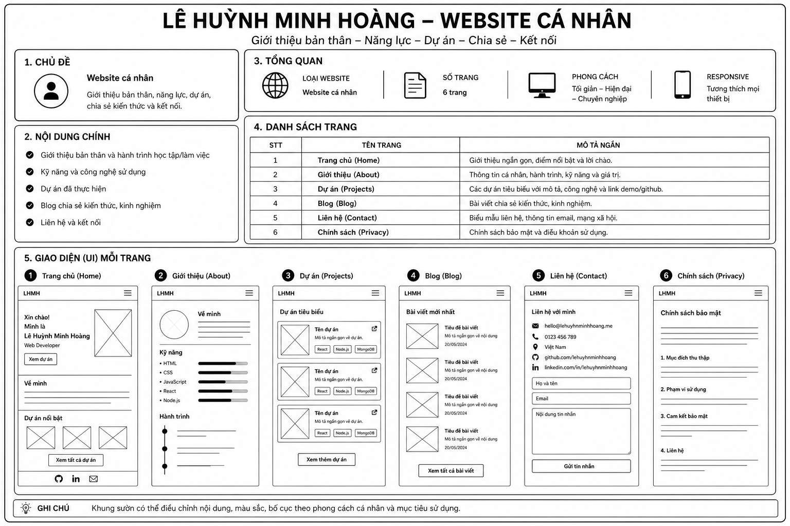

# THIẾT KẾ WEBSITE "CÔNG NGHỆ ĐIỆN TỬ"

## Giới thiệu

Xin chào, tôi là **Lê Huỳnh Minh Hoàng**.

Đây là website cá nhân của tôi, nơi giới thiệu về bản thân, các kiến thức và nội dung liên quan đến công nghệ điện tử. 
Website được thiết kế với giao diện đơn giản, dễ sử dụng, giúp người xem dễ dàng theo dõi và tìm hiểu thông tin.

## 1. Mục tiêu
- Giới thiệu về công nghệ điện tử
- Cung cấp kiến thức và sản phẩm
- Kết nối người đam mê điện tử

## 2. Cấu trúc website
Website gồm 5 trang:
- Trang chủ
- Giới thiệu
- Sản phẩm
- Dự án
- Liên hệ

## 3. Nội dung từng trang

### Trang chủ
- Banner lớn
- Giới thiệu ngắn
👉 Mục đích: gây ấn tượng ban đầu

### Trang giới thiệu
- Thông tin về công nghệ điện tử
👉 Mục đích: cung cấp kiến thức cơ bản

### Trang sản phẩm
- Linh kiện, Arduino, cảm biến
👉 Mục đích: giới thiệu sản phẩm

### Trang dự án
- Robot, nhà thông minh
👉 Mục đích: thể hiện ứng dụng thực tế

### Trang liên hệ
- Form liên hệ
👉 Mục đích: kết nối người dùng

## 4. Giao diện (UI)
- Màu chủ đạo: xanh đậm
- Menu điều hướng rõ ràng
- Layout đơn giản, dễ nhìn

Demo 

